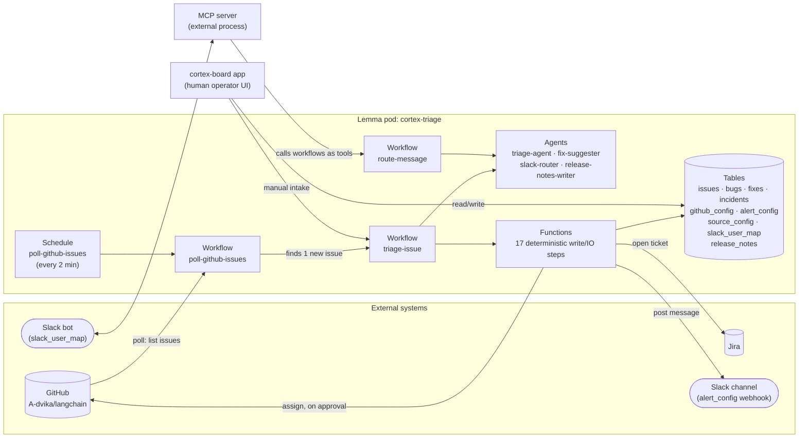
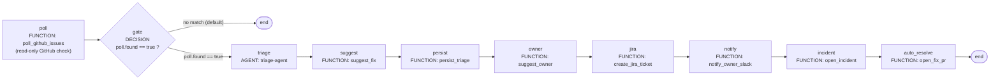
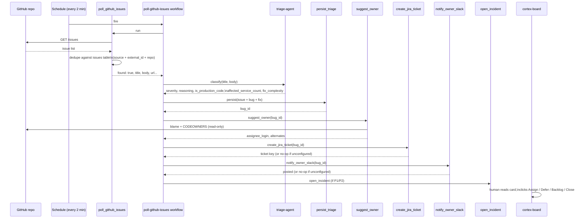

# 11 · Architecture Diagrams

Mermaid diagrams of the real, deployed Cortex-Triage pod — not an aspirational design doc. Every box here is a table, function, agent, or workflow that actually exists in `cortex-triage/`. Renders natively on GitHub, GitLab, and in most markdown viewers/editors with a Mermaid extension.

## 1. System Overview

Two front doors (the board app, a Slack agent), one backend.

## 2. Pod Resource Graph

What's actually in the pod, grouped by kind, with the judgment/write line drawn explicitly.

```mermaid
flowchart TB
    subgraph Judgment["Judgment — read-only, schema-constrained"]
        A1["triage-agent\nseverity, impact, urgency,\nproduction/blast-radius/fix-complexity"]
        A2["fix-suggester\n(scaffolded, not wired into triage-issue)"]
        A3["slack-router\nclassifies free-form Slack text\ninto an MCP tool call"]
        A4["release-notes-writer\nturns triaged bugs into release notes"]
    end

    subgraph Writes["Deterministic writes — the only things that touch state"]
        F1["persist_triage\nissues + bugs + fixes"]
        F2["suggest_owner\nblame + CODEOWNERS → bugs (suggestion only)"]
        F3["assign_owner\nGitHub write, human-approved only"]
        F4["decide_bug\nthe only writer of decision_status/human_decision"]
        F5["create_jira_ticket\nbest-effort, no-op if unconfigured"]
        F6["notify_owner_slack\nbest-effort, no-op if unconfigured"]
        F7["open_incident / ack_incident / resolve_incident / escalate_incidents"]
        F8["open_fix_pr\nlow-risk + high-confidence only"]
        F9["poll_github_issues\nread-only GitHub check"]
        F10["ingest_external_report\nnormalizes Jira/Slack/email/manual intake"]
        F11["gather_release_data / persist_release_notes / github_ping"]
    end

    subgraph State["Tables — the system of record"]
        T1[("issues")]
        T2[("bugs")]
        T3[("fixes")]
        T4[("incidents")]
        T5[("github_config")]
        T6[("alert_config")]
        T7[("source_config")]
        T8[("slack_user_map")]
        T9[("release_notes")]
    end

    A1 -.->|"structured verdict, no write access"| F1
    F1 --> T1
    F1 --> T2
    F1 --> T3
    F2 --> T2
    F3 -->|"GitHub write"| External1["GitHub"]
    F4 --> T2
    F5 --> T2
    F6 -.-> T2
    F7 --> T4
    F9 --> T1
    F10 --> T1
    F8 -->|"proposal PR"| External2["GitHub"]
```

## 3. `triage-issue` Workflow — Manual Intake

The path a report takes when a human clicks "New bug report" on the board.

```mermaid
flowchart LR
    intake["intake\nFORM"] --> triage["triage\nAGENT: triage-agent"]
    triage --> suggest["suggest\nFUNCTION: suggest_fix"]
    suggest --> persist["persist\nFUNCTION: persist_triage\n(writes issue+bug+fix)"]
    persist --> owner["owner\nFUNCTION: suggest_owner"]
    owner --> jira["jira\nFUNCTION: create_jira_ticket"]
    jira --> notify["notify\nFUNCTION: notify_owner_slack"]
    notify --> incident["incident\nFUNCTION: open_incident\n(P1/P2 only)"]
    incident --> auto_resolve["auto_resolve\nFUNCTION: open_fix_pr\n(low-risk + high-confidence only)"]
    auto_resolve --> e(["end"])
```

## 4. `poll-github-issues` Workflow — Automatic Intake

Driven by a TIME schedule every 2 minutes. The `DECISION` gate is what keeps this from running the expensive pipeline when there's nothing new.

## 5. Sequence: A New GitHub Issue Becomes a Triaged Board Card

## 6. The One Rule These Diagrams All Encode

Every arrow into a table or external system in diagrams 1–4 originates from a **function**, never from an **agent**. Agents only ever feed a function's input. That's not a convention enforced by review — each agent and function declares an explicit permission grant list in its bundle JSON, and the platform denies anything not listed. An agent has no grants to declare, because it has no table or API access to grant.